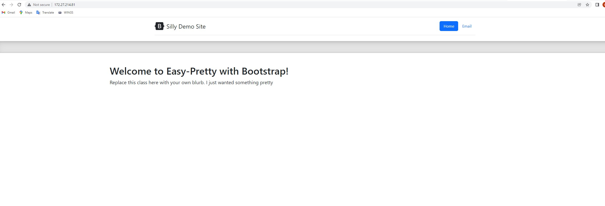

- CI Project Overview
In this project, we are using docker desktop to build containers and images which enables applications to run consistently across different environments.

- Run Project Locally
- how to install docker + dependencies: Install docker(sudo apt install docker). Windows download docker desktop. 
 Used command wsl --set-default ubuntu to set default distro to ubuntu and wsl.exe setversion (distro name) 2 to set ubuntu verson to v2.
- how to build an image from the `Dockerfile`
 Create a dockerfile FROM httpd and copied the html files in website folder . /usr/local/apache2/htdocs/.
 Used command  docker build -t website . to build the image.
- how to run the container
 Command docker run -itd -p 80:80 --name website website
- how to view the project running in the container
 Open broswer and search http://IPaddress:80

