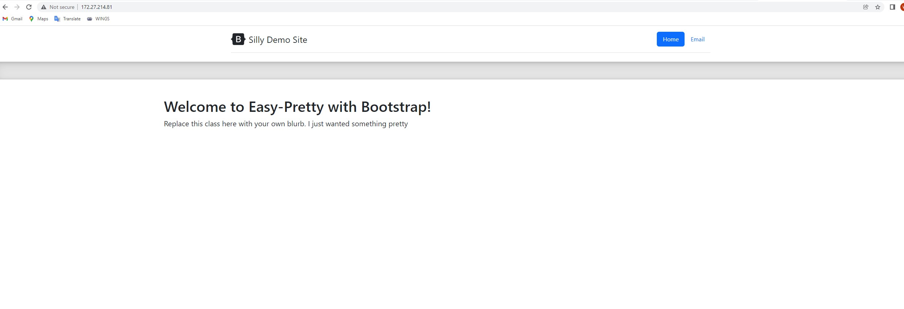
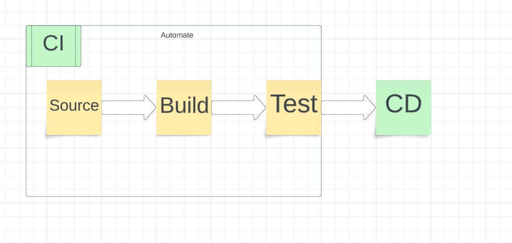

## Part 1 - Dockerize it
## CI Project Overview
- Continuous integration is a sofetware development practice which developers frequently integrat their code changes into a shared repository which verified by an automated build process. We are using docker desktop to build containers and images which enables applications to run consistently across different environments.

## how to install docker + dependencies:
 - Install docker(sudo apt install docker). Windows download docker desktop. 
 - Used command wsl --set-default ubuntu to set default distro to ubuntu and wsl.exe setversion (distro name) 2 to set ubuntu verson to v2.
## how to build an image from the `Dockerfile`
 - Create a dockerfile FROM httpd and copied the html files in website folder . /usr/local/apache2/htdocs/.Used command  docker build -t website . to build the image.
## how to run the container
 - Command docker run -itd -p 80:80 --name website website
## how to view the project running in the container
 - Open broswer and search http://IPaddress:80

## Part 2 - GitHub Actions and DockerHub
- Process to create repo on dockerhub: Click Create repository on dockerhub, choose your account name and type repo name.
- How to authenticate with DockerHub via CLI using Dockerhub credentials: Go to acount setting and security to create a token.
- How to push container image to Dockerhub: docker push weichen66/ceg3120:tagname
- Configuring GitHub Secrets:
    1, In repo settings click action under secrets and variables to create secrets.
    2, Secrets are set: DOCKERHUB_USERNAME and DOCKERHUB_TOKEN
- What does workflow do? Workflow is a automated process which run one or more jobs, and it will runs when triggered by the event in the repository. In my workflow, it check out the main branch of the repository, set up the QEMU for emulation and docker buildx for building and push docker images. Login in to docker hub using username and token, final build and push the docker images to the docker hub repository once is triggered.
- What variables in workflow are custom :Environment variables, paths, workflow triggers, job dependencies and action versions. 
- What need to be changed if someone else is going to use it or you reuse it: 1, The name of workflow. 2, The branches that trigger the workflow. 3, Environment variable. 4, Docker images tag. 5, The actions.

## Part 3- CI process

